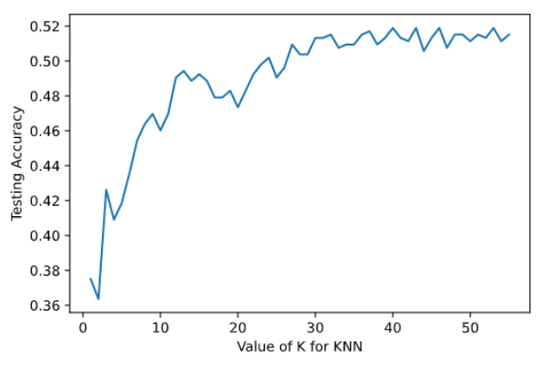

# Predicting Football Match Result

Machine learning models built using Python to predict the result of a football match, base on the teams and players statistics. Datasets used to train and test the models are retrived on Kaggle.

The probability of correctly random-guess the outcome of a match is 33.33%. The KNN model can have the accuracy up to 51%, which are close to the result obtained by previous research.

For full report and presentation, please view the Presentation folder. For the code of the models, please view the Model and Project Proposal & EDA folders. To view the original datasets and their description, refer to the other two folders.
